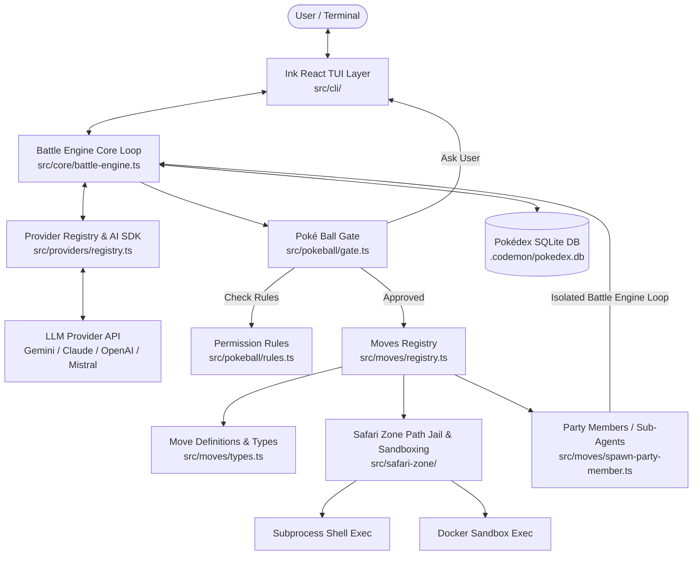

# 🏗️ Codemon Architecture & Design Guide

This document details the internal architecture, component design, data flow, and security boundaries of Codemon.

---

## 📐 System Overview

Codemon is an agentic AI coding partner built on Node/Bun, TypeScript, React Ink TUI, and Vercel AI SDK v7. It maps AI development concepts onto a Pokémon-inspired domain model:

- **Codemon**: The underlying Large Language Model (e.g. Gemini, Claude, GPT-4o, Mistral).
- **Moves**: Tools made available to the LLM (`read_file`, `edit_file`, `bash`, etc.).
- **Poké Ball**: Security permission gate (`safe`, `standard`, `yolo`) controlling move execution.
- **Region**: Project root workspace enforceably jailed by the Safari Zone.
- **Pokédex**: SQLite database for session history, message history, and file modification checkpoints.
- **Party Members**: Isolated sub-agents spawned for delegation tasks.

---

## 📊 Architecture Diagram



---

## 🧩 Core Subsystems

### 1. Ink TUI Layer (`src/cli/`)
- **[index.tsx](file:///media/anish-kumar/01DBC0C115A1D4B0/Projects/codemon/src/cli/index.tsx)**: Entry point parsing CLI flags, initializing Pokédex DB, setting up session context, and rendering the Ink React app.
- **[app.tsx](file:///media/anish-kumar/01DBC0C115A1D4B0/Projects/codemon/src/cli/app.tsx)**: Main React application state container managing interactive message lists, tool call execution UI, diff previews, and permission prompts.

### 2. Battle Engine (`src/core/battle-engine.ts`)
The Battle Engine controls the primary agent loop:
1. Accepts user prompts and repository context generated by `repo-indexer.ts`.
2. Sends history + tool definitions to the LLM via `streamText()`.
3. Intercepts generated tool calls before execution.
4. Routes requested move through the Poké Ball Gate for permission validation.
5. Saves file checkpoints to Pokédex DB before executing file-modifying moves (`edit_file`, `write_file`).
6. Executes approved moves and returns execution results back into the conversation context stream.

### 3. Poké Ball Permission Gate (`src/pokeball/`)
- **[rules.ts](file:///media/anish-kumar/01DBC0C115A1D4B0/Projects/codemon/src/pokeball/rules.ts)**: Configures permission matrices for `safe`, `standard`, and `yolo` modes based on `PermissionLevel` (`read`, `write`, `bash`).
- **[gate.ts](file:///media/anish-kumar/01DBC0C115A1D4B0/Projects/codemon/src/pokeball/gate.ts)**: Evaluates requested move operations against current mode rules and session-level "Always allow" grants. If authorization is required, it suspends execution and prompts the user via TUI.
- **[audit-log.ts](file:///media/anish-kumar/01DBC0C115A1D4B0/Projects/codemon/src/pokeball/audit-log.ts)**: Records permission decisions to log outputs.

### 4. Moves System & Decoupled Types (`src/moves/`)
- **[types.ts](file:///media/anish-kumar/01DBC0C115A1D4B0/Projects/codemon/src/moves/types.ts)**: Defines the core interface contract:
  ```ts
  export type PermissionLevel = "read" | "write" | "bash";

  export interface MoveDefinition<TSchema extends z.ZodType = z.ZodType> {
    name: string;
    description: string;
    parameters: TSchema;
    permissionLevel: PermissionLevel;
    execute(args: z.infer<TSchema>): Promise<unknown>;
  }
  ```
- **[registry.ts](file:///media/anish-kumar/01DBC0C115A1D4B0/Projects/codemon/src/moves/registry.ts)**: Aggregates move instances and converts them to Vercel AI SDK `ToolSet` schema objects (`buildToolSet()`).
- Individual move implementations ([bash.ts](file:///media/anish-kumar/01DBC0C115A1D4B0/Projects/codemon/src/moves/bash.ts), [edit-file.ts](file:///media/anish-kumar/01DBC0C115A1D4B0/Projects/codemon/src/moves/edit-file.ts), etc.) import `MoveDefinition` from `types.ts`, preventing circular dependencies.

### 5. Safari Zone Sandboxing (`src/safari-zone/`)
- **[path-jail.ts](file:///media/anish-kumar/01DBC0C115A1D4B0/Projects/codemon/src/safari-zone/path-jail.ts)**: Enforces path sandboxing (`jailPath()`) to prevent file access or edits outside the specified region root directory.
- **[shell-executor.ts](file:///media/anish-kumar/01DBC0C115A1D4B0/Projects/codemon/src/safari-zone/shell-executor.ts)**: Runs subprocess shell commands safely with timeouts and output capture.
- **[docker-executor.ts](file:///media/anish-kumar/01DBC0C115A1D4B0/Projects/codemon/src/safari-zone/docker-executor.ts)**: Provides Docker sandbox execution when `--sandbox docker` is specified, isolating command execution in container environments.

### 6. Pokédex SQLite Persistence (`src/pokedex/`)
- **[db.ts](file:///media/anish-kumar/01DBC0C115A1D4B0/Projects/codemon/src/pokedex/db.ts)**: Manages SQLite database connection stored in `.codemon/pokedex.db`.
- **[sessions.repo.ts](file:///media/anish-kumar/01DBC0C115A1D4B0/Projects/codemon/src/pokedex/sessions.repo.ts)**: Stores session metadata and message logs for `--continue` session restoration and `--sessions` listing.
- **[checkpoints.repo.ts](file:///media/anish-kumar/01DBC0C115A1D4B0/Projects/codemon/src/pokedex/checkpoints.repo.ts)**: Records pre-edit file states before `edit_file` or `write_file` moves, enabling full file rollback via `--rewind`.

### 7. Party Members / Sub-Agents (`src/moves/spawn-party-member.ts`)
`spawn_party_member` allows Codemon to spawn focused sub-agents with clean context windows. Sub-agents run isolated Battle Engine loops to perform deep code exploration or multi-step tasks, returning concise result summaries back to the parent agent.

---

## 🔒 Security Design Principles

1. **Explicit Permission Gates**: Write and shell operations are restricted by default in `standard` and `safe` modes.
2. **Jailed File Access**: All path resolutions are validated through `jailPath()` to prevent path traversal attacks (`../..`).
3. **Containerized Execution Options**: Commands can be executed inside ephemeral Docker containers using `--sandbox docker`.
