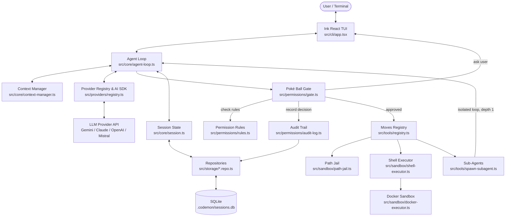

# 🏗️ Codemon Architecture & Design Guide

This document details the internal architecture, component design, data flow, and security boundaries of Codemon.

---

## 📐 System Overview

Codemon is an agentic AI coding partner built on Node/Bun, TypeScript, React Ink TUI, and Vercel AI SDK v7. It maps AI development concepts onto a Pokémon-inspired domain model:

- **Codemon**: The underlying Large Language Model (e.g. Gemini, Claude, GPT-4o, Mistral).
- **Moves**: Tools made available to the LLM (`read_file`, `edit_file`, `bash`, etc.).
- **Poké Ball**: Security permission gate (`safe`, `standard`, `yolo`) controlling move execution.
- **Region**: Project root workspace enforceably jailed by the Safari Zone.
- **Pokédex**: SQLite database for session history, message history, and file modification checkpoints.
- **Party Members**: Isolated sub-agents spawned for delegation tasks.

---

## 📊 Architecture Diagram

---

## 🧩 Core Subsystems

### 1. Ink TUI Layer (`src/cli/`)
- **[index.tsx](../src/cli/index.tsx)**: Entry point — resolves the region, loads config, initializes the session database, runs the flag subcommands (`--sessions`, `--audit`, `--rewind`, `--eval`), and renders the Ink React app.
- **[parse-args.ts](../src/cli/parse-args.ts)**: The flag table and the usage text, together so they cannot drift. Every flag declares whether it takes a value; a missing value, an unknown flag, or an invalid `--mode`/`--sandbox` is rejected here, before anything starts up.
- **[app.tsx](../src/cli/app.tsx)**: Main React state container managing the message list, tool call UI, diff previews, and permission prompts.
- **[components/](../src/cli/components/)** and **[commands/](../src/cli/commands/)**: Rendered pieces of the interface, and the slash commands (`/connector`, `/help`, `/clear`, …) the input line dispatches against.

### 2. Agent Loop (`src/core/agent-loop.ts`)
The [agent loop](../src/core/agent-loop.ts) drives one user message to completion:
1. Accepts the user prompt plus repository context from [repo-indexer.ts](../src/core/repo-indexer.ts).
2. Sends history + tool definitions to the LLM via `streamText()`, after [context-manager.ts](../src/core/context-manager.ts) trims the history on turn boundaries if it is near the budget.
3. Intercepts generated tool calls before execution, and rejects any name outside the caller's tool filter.
4. Routes each requested move through the Poké Ball Gate for permission validation.
5. Saves a file checkpoint before executing a file-modifying move (`edit_file`, `write_file`).
6. Executes approved moves and feeds the results back into the stream.
7. Stops at `maxTurns` (default 25) with a visible message, so a retry spiral cannot run unbounded.

Session state — messages, model, cumulative prompt/completion tokens — lives in
[session.ts](../src/core/session.ts); the provider instance the loop streams through lives in
[provider-instance.ts](../src/core/provider-instance.ts).

### 3. Poké Ball Permission Gate (`src/permissions/`)
- **[rules.ts](../src/permissions/rules.ts)**: Defines explicit permission matrices for security modes:
  - **`safe`**: `autoAllow: ["read"]`, `requireConfirm: ["write", "bash"]` — prompts user before modifying any files or executing shell commands.
  - **`standard`** (default): `autoAllow: ["read", "write"]`, `requireConfirm: ["bash"]` — auto-allows direct file edits/writes within the project root, but prompts user before executing shell commands.
  - **`yolo`**: `autoAllow: ["read", "write", "bash"]` — auto-approves all moves without prompts.
  - An unrecognised mode falls through to confirming everything rather than throwing, so a hand-edited config file cannot take the gate down.
- **[gate.ts](../src/permissions/gate.ts)**: Evaluates requested move operations against mode rules and session-level "Always allow" grants. If authorization is required, it suspends execution and prompts the user via TUI.
- **[audit-log.ts](../src/permissions/audit-log.ts)**: Records every decision — including auto-allows — to the `permission_decisions` table via [audit.repo.ts](../src/storage/audit.repo.ts). Read it back with `codemon --audit [session-id]`.

### 4. Moves System & Decoupled Types (`src/tools/`)
- **[types.ts](../src/tools/types.ts)**: Defines the core tool interface contract (`ToolDefinition`).
- **[registry.ts](../src/tools/registry.ts)**: Aggregates move instances and converts them to Vercel AI SDK `ToolSet` schema objects (`buildToolSet()`).
- **The eight moves**: [read_file](../src/tools/read-file.ts), [write_file](../src/tools/write-file.ts), [edit_file](../src/tools/edit-file.ts), [list_dir](../src/tools/list-dir.ts), [bash](../src/tools/bash.ts), [grep](../src/tools/grep.ts), [glob](../src/tools/glob.ts), [spawn_subagent](../src/tools/spawn-subagent.ts).
- **[diff-apply.ts](../src/utils/diff-apply.ts)**: The matcher behind `edit_file`. Exact match first — refusing when the target appears more than once — then a fuzzy pass that refuses when a second block scores nearly as well, rather than picking one.

### 5. Safari Zone Sandboxing (`src/sandbox/`)
- **Path Jail ([path-jail.ts](../src/sandbox/path-jail.ts))**: Validates path parameters for structured file moves (`read_file`, `write_file`, `edit_file`, `list_dir`, `grep`, `glob`). Resolves symlinks before comparing against the project root, so a link pointing outside the region does not pass on the strength of its in-root name.
- **Default Subprocess Execution ([shell-executor.ts](../src/sandbox/shell-executor.ts))**: `bash` commands run as host OS subprocesses within the working directory. `shellExec` is the `bash -c` path and exists for the `bash` tool alone; every other caller uses `shellExecArgv`, which spawns an argv array with no shell between it and the process. **Security Boundary Note**: `jailPath()` does not parse or sanitize raw shell strings (e.g. `rm -rf ~`, `cd ..`). By default, human approval via the Poké Ball Gate is the boundary between the model and host filesystem.
- **Docker Container Isolation ([docker-executor.ts](../src/sandbox/docker-executor.ts))**: When `--sandbox docker` is specified, `bash` commands run inside an isolated container (`codemon-sandbox:latest`) with:
  - `-v <projectRoot>:/workspace` (workspace mounted at `/workspace`)
  - `--network none` (network disabled by default)
  - `--memory 512m --cpus 1` (resource caps)
  - `--init --rm` (ephemeral container execution)

### 6. Pokédex SQLite Persistence & Checkpoints (`src/storage/`)
- **[db.ts](../src/storage/db.ts)**: Owns the SQLite connection at `.codemon/sessions.db` (gitignored) and the schema: `sessions`, `messages`, `checkpoints`, `permission_decisions`. `CREATE TABLE IF NOT EXISTS` leaves an existing table alone, so columns added after the first release are attached by an explicit migration step at startup.
- **[sessions.repo.ts](../src/storage/sessions.repo.ts)**: Stores session metadata and message logs for `--continue` session restoration and `--sessions` listing.
- **[checkpoints.repo.ts](../src/storage/checkpoints.repo.ts)**: Records the initial state of files before modification via `edit_file` or `write_file` moves, enabling rollback via `--rewind`. Only the first checkpoint per file per session is kept, so a rewind restores the pre-session state rather than the state before the most recent edit.
  - **Checkpoint Scope**: Note that `--rewind` restores files saved via direct file tool modifications. Indirect modifications made via arbitrary shell commands inside `bash` (e.g., `sed`, `rm`, `git`) are not intercepted by file checkpoint hooks.
- **[audit.repo.ts](../src/storage/audit.repo.ts)**: The permission decision trail. Deliberately carries no foreign key to `sessions` — evals and sub-agents make decisions without a session row, and a constraint violation there would take down the gate rather than lose a log line.

### 7. Party Members / Sub-Agents (`src/tools/spawn-subagent.ts`)
- **Isolated Context**: `spawn_subagent` delegates sub-tasks to fresh sub-agent instances with clean context windows.
- **Recursion Hard Cap**: A sub-agent is always given a tool filter, defaulting to `AVAILABLE_TOOLS`, which leaves out `spawn_subagent`. The filter is enforced where tools are executed rather than only in the toolset the model is shown, so a sub-agent that emits the name anyway gets a tool-error. Maximum recursion depth is 1.
- **Inherited Permissions**: The sub-agent runs in the parent's permission mode, not `yolo`. There is no interactive prompt behind it, so anything that would need confirmation is auto-denied — from `safe` mode a sub-agent is effectively read-only.

### 8. Provider Registry (`src/providers/`)
- **[registry.ts](../src/providers/registry.ts)**: The single path to a model. Builds a Vercel AI SDK provider registry over Google, Anthropic, OpenAI and Mistral, addressed as `provider:model-name`, and adapts the SDK's stream into Codemon's own `StreamEvent` shape.
- **[model-fetcher.ts](../src/providers/model-fetcher.ts)**: Lists models live from the selected provider for `/connector`, falling back to a curated list when the call fails.
- **[types.ts](../src/providers/types.ts)**: The `Provider` interface the agent loop consumes, so the loop never imports an SDK directly.

### 9. User Configuration & Credential Security (`src/config/`)
- **[defaults.ts](../src/config/defaults.ts)** assembles the runtime `CodemonConfig` from the chain below; **[user-config.ts](../src/config/user-config.ts)** owns `~/.codemon/config.json`, the credentials in it, and the model `/connector` saves.
- **Interactive Connector**: Manages API key entry and model configuration via the `/connector` TUI slash command.
- **Strict POSIX 0600 Permissions**: Saves credentials to `~/.codemon/config.json` with strict mode `0600` permissions (`-rw-------`), protecting file reads from other system accounts.
- **Masked Key Display**: Formats stored keys as `••••••••1a4f` showing only the last 4 characters in terminal displays.
- **Precedence Hierarchy**: Resolves configuration in strict order, highest first:
  `CLI Flag (--model)` > `Environment ($CODEMON_MODEL, $GEMINI_API_KEY)` >
  `Project-Local Config (<project>/.codemon/config.json)` > `Project Config (<project>/codemon.json)` >
  `User Config (~/.codemon/config.json)` > `Built-in Default`.
  The two project files are read from the region (`--region`), not the launch directory.
- **Credential Isolation**: `loadConfig` copies only the keys `CodemonConfig` declares out of the
  config files, so `apiKeys` never enters the runtime config object that sub-agents and the eval
  runner receive. `defaultModel` — the key `/connector` writes — is read as the user-level `model`.

### 10. Evals & Tests (`src/evals/`, `src/**/*.test.ts`)
- **[evals/runner.ts](../src/evals/runner.ts)** and **[evals/benchmarks.ts](../src/evals/benchmarks.ts)**: `codemon --eval` runs each case in a throwaway temp directory against a real model, then checks the outcome — used for behaviour that only shows up end to end, like whether the gate holds under an adversarial prompt.
- **Unit tests** live beside the code as `*.test.ts` and run with `bun test`. No API key or network is needed: the agent-loop tests drive a scripted provider that emits whatever stream events the case calls for, and the tool and storage tests work in temp directories.

---

## 🔒 Security Design Principles

1. **Explicit Permission Gates**: Write and shell operations are restricted by default in `standard` and `safe` modes.
2. **Jailed File Access**: Path resolution for structured file moves is enforced through `jailPath()` to prevent traversal outside the project root (`../..`).
3. **Containerized Execution Option**: For OS-level container sandboxing, `--sandbox docker` runs shell commands inside network-isolated Docker containers (`--network none`, restricted memory/CPU).
4. **Credential Security**: Credentials saved via `/connector` are stored with POSIX `0600` owner-only permissions (`-rw-------`) and masked in TUI outputs.

